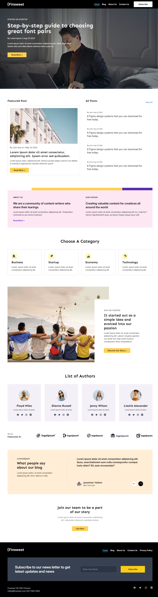
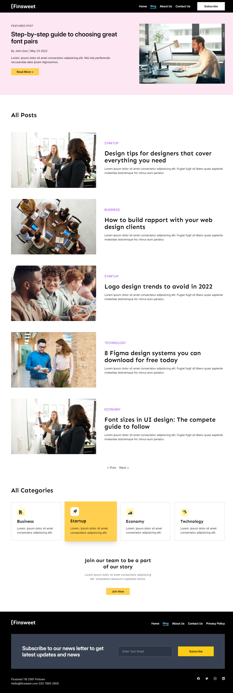
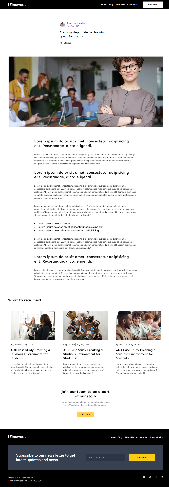
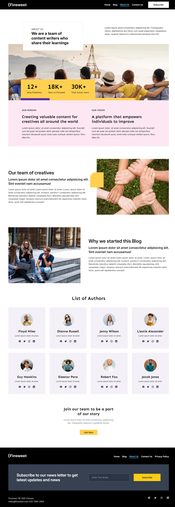
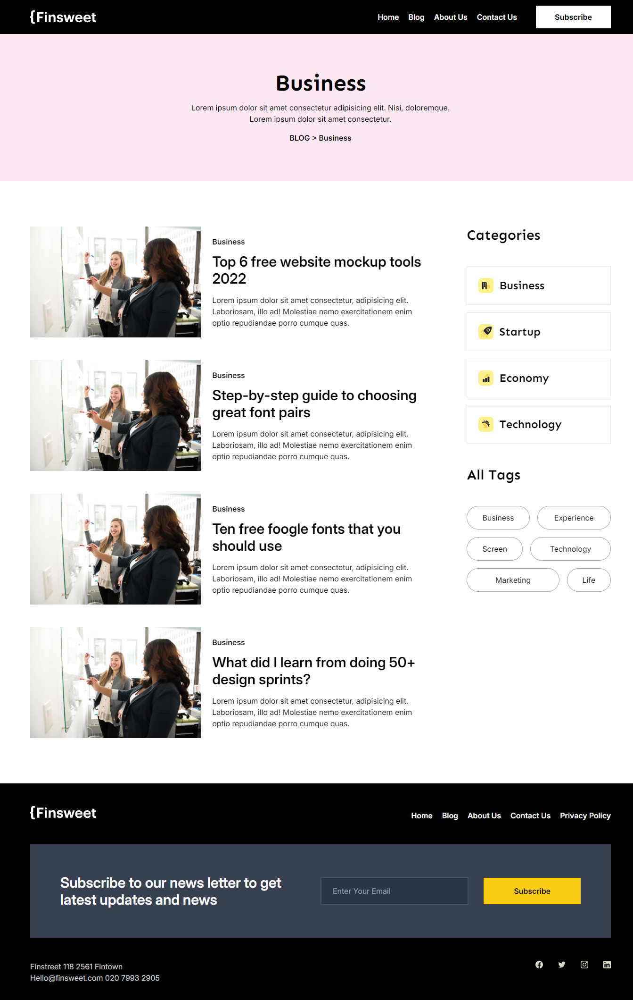
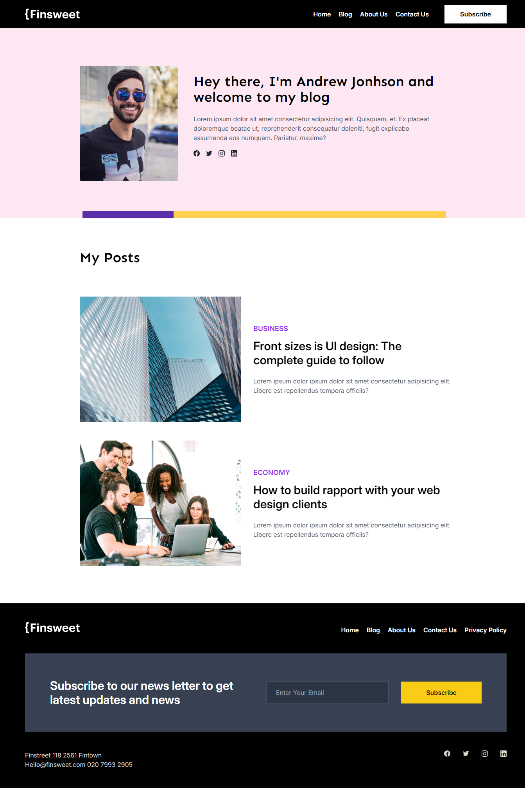
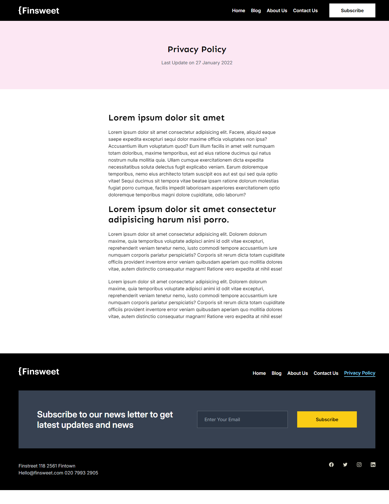

# Frontend Assignment Flipr

## Table of Contents

- [Project Overview](#project-overview)
- [Features](#features)
- [Live Demo](#live-demo)
- [Technologies Used](#technologies-used)
- [Getting Started](#getting-started)
- [Screenshots](#screenshots)

---

## Project Overview

This project is a responsive, multi-page website created as part of an assignment. It includes key pages such as Home, Blog, Blog Post, About Us, Category, Author, Contact, and Privacy Policy. The design emphasizes modular, reusable components and a clean UI that adapts seamlessly across devices. Enhanced hover effects, a cohesive color palette, and consistent typography ensure a polished user experience. Built with React, the project uses Tailwind CSS for styling and React Router for client-side navigation.

## Features

- **Modular Components**: Reusable components designed for scalability.
- **Clean UI**: Adheres to the provided color palette and font specifications.
- **Hover Effects**: Enhanced hover effects to improve user experience.
- **Responsive Design**: Adapts to mobile, tablet, and desktop.

## Live Demo

Check out the live demo of the project here: [Deployed Project Link](https://frontend-assignment-flipr.netlify.app/)

## Technologies Used

- **React**: for building the user interface
- **Tailwind CSS**: for styling
- **React Router**: for client-side routing
- **AOS**: for adding animations on scroll

## Getting Started

### Prerequisites

Make sure you have the following installed on your local development environment:

- [Node.js and npm](https://nodejs.org/)
- Git

### Installation

1. Clone the repository:

   ```bash
   git clone https://github.com/himanshu-paliwal-277/Frontend-Assignment-Flipr.git

   ```

2. Navigate into the project directory:

   ```bash
    cd Frontend-Assignment-Flipr
   ```

3. Install the dependencies:

   ```bash
   npm install
   ```

4. Start the development server:

   ```bash
   npm run dev
   ```

## Screenshots

### Home Page



### Blog Page



### Blog Post Page



### About Us Page



### Category Page



### Author Page



### Contact Page


### Privacy Policy Page


