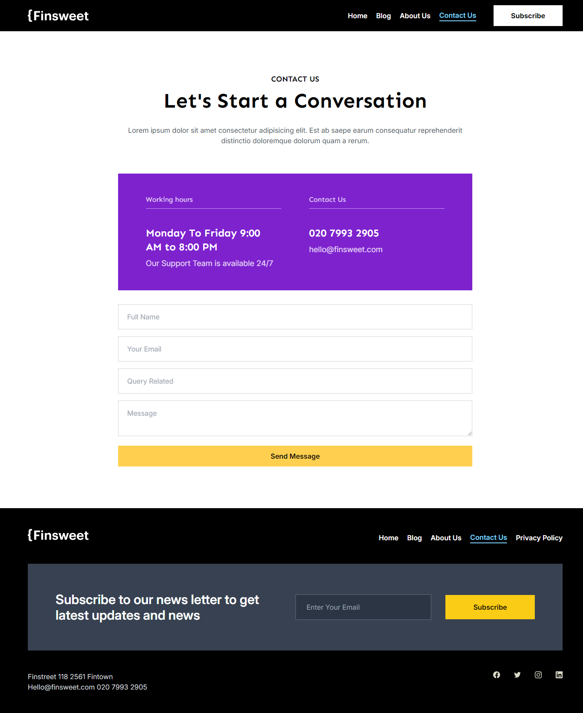

# Frontend Assignment Flipr

## Project Overview

The aim of this project is to create a seamless, responsive web design that adapts flawlessly across desktops, laptops, and mobile devices. The code adheres to best practices in readability, modularity, and scalability, ensuring long-term maintainability.

## Features

- **Responsive Design** : Ensures optimal viewing and functionality across all devices.
- **Hover Effects**: Enhanced interactivity with consistent hover effects on buttons, cards, and other elements.
- **Mobile-Friendly Layout**: Card-based design for improved readability and usability on smaller screens.
- **Animations**: Subtle animations to enrich the user experience without compromising usability.
- **Modular Code Structure**: Reusable components for better scalability and maintainability.
- **Style Consistency**: Adherence to a unified design language, including a predefined color palette and font family.

## Live Demo

[Deployed Project Link](https://flipr-assign.netlify.app/)

## Technologies Used

- **React**: for building the user interface
- **Tailwind CSS**: for styling
- **React Router**: for client-side routing
- **AOS**: for adding animations on scroll

## Getting Started

### Prerequisites

Make sure you have the following installed on your local development environment:

- [Node.js and npm](https://nodejs.org/)
- Git

### Installation

1. Clone the repository:

   ```bash
   git clone https://github.com/naman8033/Frontend-Assignment-Flipr.git

   ```

2. Navigate into the project directory:

   ```bash
    cd Frontend-Assignment-Flipr
   ```

3. Install the dependencies:

   ```bash
   npm install
   ```

4. Start the development server:

   ```bash
   npm run dev
   ```

## Screenshots

### Home Page


### Blog Page


### Blog Post Page


### About Us Page


### Category Page


### Author Page


### Contact Page



### Privacy Policy Page


